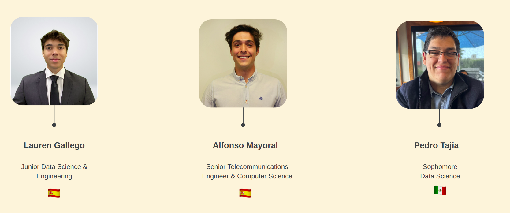
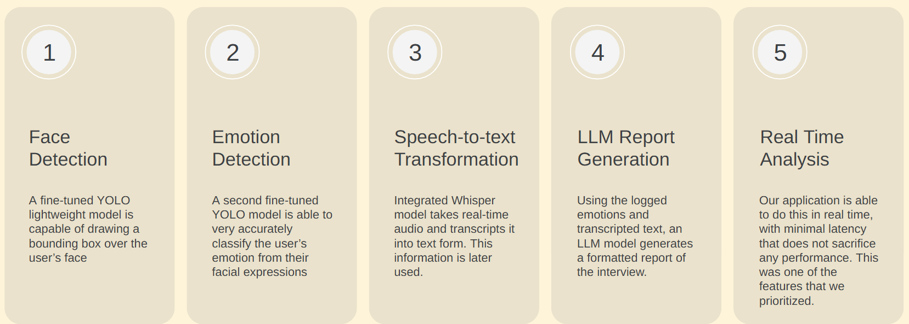
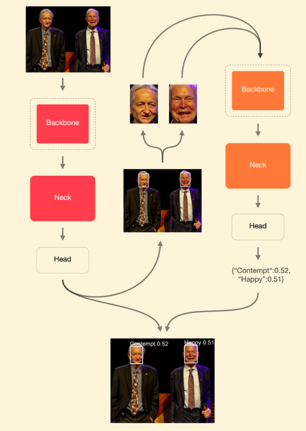
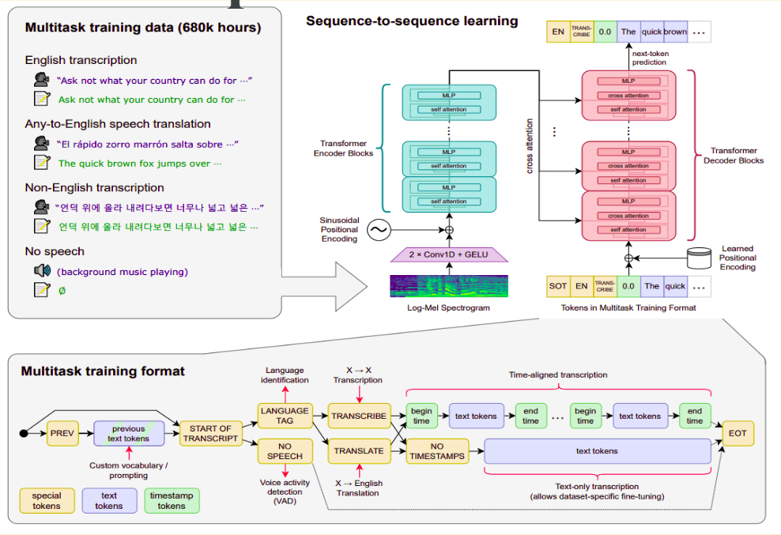
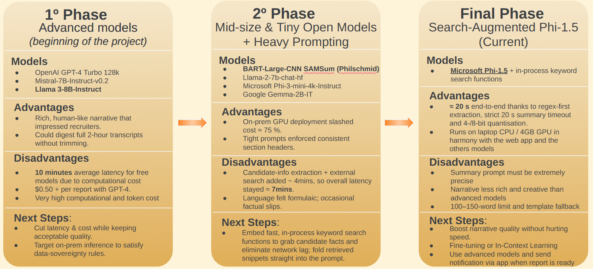
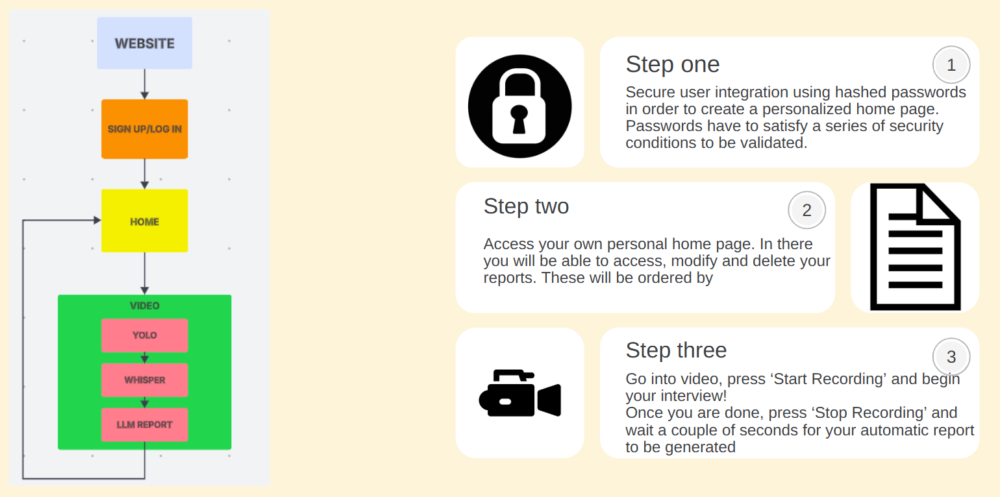

# IntelliView - AI Interview Assistant - AISC@Riv Competitive Project
> Face & emotion detection · Whisper speech-to-text with timestamps · **Intelligent Report Agent** in ~20s · Privacy-friendly on-prem pipeline

<p align="center">
  <a href="#"></a>
  <a href="#"></a>
  <a href="#"></a>
  <a href="#"></a>
  <a href="#"></a>
</p>

---

## 🧭 Table of Contents
- 👥 [Contributors](#contributors)
- 📘 [Overview](#overview)
- ✨ [Key Features](#key-features)
- 🏗️ [Architecture](#architecture)
- 🔬 [How It Works (Technical Deep Dive)](#how-it-works-technical-deep-dive)
  - 👁️ [1) Computer Vision](#1-computer-vision)
  - 🗣️ [2) Speech-to-Text](#2-speech-to-text)
  - 🤖 [3) Intelligent Report Agent (focus area)](#3-intelligent-report-agent-focus-area)
- 📂 [Repository Structure](#repository-structure)
- 🛠️ [Installation](#installation)
- ⚡ [Quick Start](#quick-start)
- ⏱️ [Performance & Cost](#performance--cost)
- ⚠️ [Known Limitations](#known-limitations)

---
## Contributors


## Overview
**IntelliView** is a real-time assistant for video interviews. During a call (or a local recording), the system:
1. detects the **face** of the candidate,  
2. classifies their **emotion** frame-by-frame,  
3. **transcribes** audio with **Whisper** (timestamped tokens), and  
4. produces a **concise, recruiter-friendly report** using a low-latency **LLM agent**.

This tool targets both **employers** (consistent, auditable interview logs) and **candidates** (guided practice with objective feedback). The “product view” and target audiences are laid out in the project presentation.



---

## Key Features
- **Real-time perception** and end-to-end **~20s** report latency with on-device inference (quantized LLM + regex-first extraction).
- **Face detection** and **emotion classification** with a **two-model YOLO** setup after iterating away from a single multitask model that suffered catastrophic forgetting.
- **Speech-to-text** via **Whisper-small**, streaming **20 ms** token timestamps for precise A/V alignment.
- **Report agent** with deterministic fallback, strict timeout (20s), and 100–150-word summaries.
- **Privacy**: full **on-prem** capability (no external audio upload required).
- **Web app** flow (login → dashboard of reports → record → auto-report).

---

## Architecture


## How It Works (Technical Deep Dive)
### 1) Computer Vision
  - Face detection (YOLO): lightweight model tuned for FPS on laptop-class GPUs/CPUs.
  - Emotion classification (YOLO): a separate fine-tuned model for expressions.
  - Iteration: early single-model approach (multi-dataset Kaggle + AffectNet) degraded due to catastrophic forgetting, so the system split into two heads/two models (“Final YOLO System”). 



### 2) Speech-to-Text
  - VAD (WebRTC) segments audio (≈30 ms frames) and filters silence/noise.
  - Frames → log-Mel spectrogram → Whisper-small (encoder–decoder Transformer).
  - Output: text tokens with ~20 ms timestamps, enabling direct alignment with video and emotion streams and CSV logging for the downstream agent. 



### 3) Intelligent Report Agent (focus area)
  - Owner: Alfonso Mayoral — design, optimization, and deployment of the reporting agent.
  - Goal: transform the transcript (and auxiliary signals) into a 100–150-word summary + key candidate fields in ≤ 20 s.  
  - Pipeline (7 steps):
    IMAGEN DENTRO DE img/pipeline-report-agent.png
  - Model evolution & trade-offs:
    - Phase 1 — Big models: GPT-4 Turbo, Mistral-7B, Llama-3-8B → excellent narrative, 2-hour transcripts OK, but ~10 min/report and cloud cost/privacy concerns.
    - Phase 2 — Mid/Tiny OSS: BART-SAMSum, Llama-2-7B, Phi-3-mini, Gemma-2B → on-prem GPU cut cost by ≈ 75%, but external search added latency (≈ 7 min total), prompts brittle on very long transcripts.
    - Phase 3 — Search-augmented Phi-1.5 (current): in-process keyword search + regex-first and 4/8-bit quantization → ~20 s end-to-end on a laptop GPU (~4 GB); factual tone; limit ≤ 150 words. 



## Repository Structure
```bash
AISC_Competitive_Project_Web/
├─ data/                  # Model weights / sample data
├─ website/               # Frontend (HTML/JS/CSS) and generated reports
├─ main.py                # Orchestrates the end-to-end pipeline / web integration
├─ report_agent_1_5.py    # Report agent (Phi-1.5 + regex/keywords)
├─ test_camera.py         # Camera utilities
├─ prueba_GPU.py          # GPU / quantization quick tests
├─ requirements.txt       # Python dependencies
└─ README.md              # This file
```


## Installation
- Prerequisites
  - Python 3.10+
  - ffmpeg in your PATH (recommended for audio/Whisper)
  - Optional GPU (NVIDIA CUDA 11/12) for accelerating YOLO/Whisper/LLM
    > The pipeline also runs on CPU with higher latency.
- Setup
```bash
# 1) Clone
git clone https://github.com/alfonsomayoral/AISC_Competitive_Project_Web.git
cd AISC_Competitive_Project_Web

# 2) Create & activate a virtual environment
python -m venv .venv
# Windows:
.venv\Scripts\activate
# macOS/Linux:
source .venv/bin/activate

# 3) Install dependencies
pip install -r requirements.txt
```
> Place YOLO weights and the quantized LLM weights (if used) under data/ or point to them via environment variables (see below).

## Quick Start
### Option A — Local web app
1. Launch the backend/orchestrator:
```bash
python main.py
```
2. Serve the static frontend:
```bash
# in a separate terminal
python -m http.server 8000 -d website
# open http://localhost:8000
```
3. On the page: Start Recording → run the interview → Stop Recording.
4. The report appears after roughly 20 seconds and can be downloaded as TXT/MD/HTML.
Screenshot placeholder: docs/img/ui-start-stop.png (export the “Start/Stop Recording” UI from the demo slide).

### Option B — Offline transcript → report
> If you already have a timestamped CSV transcript, you can generate a report directly:
```bash
# Example — adapt to the actual CLI in report_agent_1_5.py
python report_agent_1_5.py \
  --transcript data/interview.csv \
  --out-format md \
  --out-path website/reports/2025-05-27_interview.md
```

## Performance & Cost
- End-to-end (audio → report): ≈ 20 s on a laptop-class GPU (~4 GB) using Phi-1.5 (4/8-bit) with regex-first extraction and a 20 s generation cap.
- Cost: on-prem inference ⇒ near-zero per report.
- Privacy: no external audio upload in local mode. 

Suggested image: export “Comparison of Tested Models’ Results” (Llama-3-8B vs BART-SAMSum, etc.) to docs/img/model-comparisons.png. 

## Known Limitations
- Summary tone is factual/concise rather than narrative.
- Hard constraints (≤ 150 words, 20 s timeout) may trim less critical details.
- Emotion classification quality depends on lighting, framing, and dataset bias.
- Whisper-small can struggle with heavy overlapping speech or very noisy environments. 
